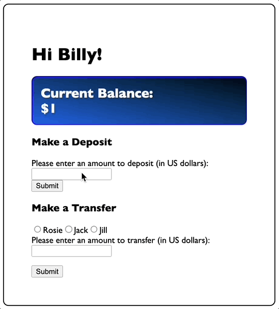
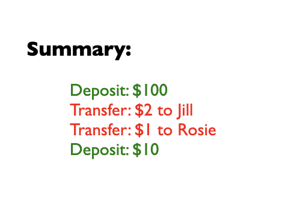

# About This App:
For Techtonica, we practiced creating a constructor and ensuring those methods worked with a full web page using just HTML, CSS, and JavaScript.

For this challenge, I learned a lot about manipulating DOM elements solely through scripts.

With this app, the user, "Billy", can make a "deposit" or "transfer" to another user, as so:

Once the user makes a deposit or transfer, this app will add a summary section:

We also have basic validation:

---
#Spec
### Modeling a bank account

Write a program that creates an `account` object with the following characteristics:

* A `name` property.
* A `balance` property set to 0.
* A `deposit` method adding the (positive or negative) value passed as an argument to the account balance.
* A `describe` method returning the account description.
* A `transfer` method with two paramethers: the name of the account that will receive the transfer, and the amount of money to transfer. 

## Test
- Create an account for Billy, Rosie, Jack and Jill
- Give each of the accounts a deposity on money
- Print a string describing the current amount of money on each account
- Transfer positive values between Billy and Jack and negative values between Rosie and Jack

# Extra
- Can you thing how a `credit` method should work? 

(NOTE: this portion of the assignement will be in JS only, you will build upon it in the future to add HTML)